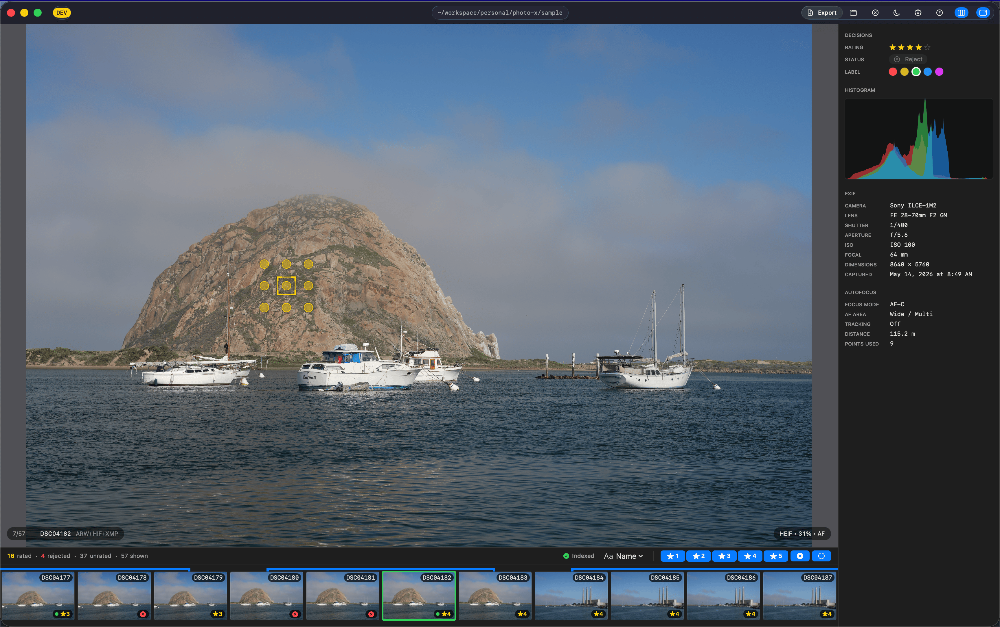
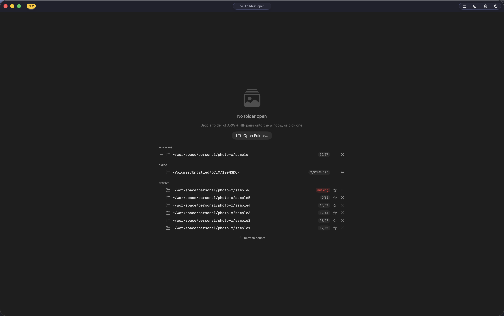

# PhotoX

> A fast macOS culling viewer for paired RAW + HEIF photo shoots.

[](https://github.com/Frostman/photo-x/releases/latest)
[](#installation)
[](LICENSE)



PhotoX is a focused, single-purpose tool for the part of photography
nobody enjoys: looking at every frame after a shoot and deciding what
to keep. Open a folder (or a CFExpress / SD card straight out of the
camera) and you're culling within seconds — no import, no catalog, no
proprietary database. Your ratings live in plain XMP sidecar files
next to the originals, so Lightroom, Photomator (or anything else
that reads XMP) picks them up later.

## Why PhotoX

The mainstream tools — Lightroom, Photomator, Capture One, Photo Mechanic — are
built around catalogs and asset management. They're great at organising
the work, slow at the part where you just need to look at a frame, hit
a number, and move on. PhotoX is a culling-first app: instant
navigation, GPU-accelerated viewer, Lightroom / Photomator-compatible ratings,
zero setup. After culling, your decisions follow your files wherever
they go next.

## How it works

- **Non-destructive ratings.** Stars, color labels, reject flags, and
  the keep/reject decision are written to a `<stem>.xmp` sidecar file
  next to the RAW. PhotoX *never* modifies the original `.ARW`,
  `.HIF`, or their embedded EXIF. The sidecar format matches what
  Lightroom and Photomator write — you can cull in PhotoX, then
  open the same folder in either and the ratings are there waiting.
- **No catalog, no import.** Point PhotoX at a folder and start. No
  database. No "import" wizard. No per-shoot setup. Close the window
  and the next folder is one ⌘O away.
- **Lazy file reads.** The filmstrip thumbnails and sidebar EXIF only
  need the first ~256 KB of each HEIF — the embedded JPEG and the
  Exif TIFF block live in the file header. PhotoX parses both
  in-process (no exiftool round-trip for basic EXIF, no full HEVC
  decode) so a 5 000-shot folder finishes indexing in ~30 s.
- **HEIF first, RAW on demand.** The HEIF preview is what you see
  during the culling browse — fast to decode, plenty of detail for
  decisions. The matching ARW is only decoded when you zoom past
  100 % or press `Z` to switch variant. RAW decode is comparatively
  expensive; PhotoX doesn't pay for it until you actually want it.
- **GPU display.** The canvas is a Metal layer with a small texture
  cache. EXIF orientation is applied via shader UV-transform (no CPU
  rotation pass for portrait frames). Back-and-forth between two
  recently-viewed frames is effectively instant — under 30 ms.

## Features

### Culling workflow

- 1–5 star ratings, color labels (Red/Yellow/Green/Blue/Purple),
  reject flag — all via hotkeys (1–5, ⇧1–5, R) or the Decisions
  panel.
- Burst-aware reject: `G` rejects all sibling frames of the current
  burst in one keystroke (scope set in Settings).
- Undo / redo (`⌘Z` / `⌘⇧Z`) across every rating, label, and
  burst-reject — round-trips XMP on disk too.
- Auto-advance after rating (opt-in, separate setting for keyboard
  vs sidebar inputs).
- Filter the view by rating / reject / star level so you can re-cull
  a subset.
- All decisions persist to XMP sidecar files next to the RAW.
  Lightroom and Photomator read them; PhotoX reads what they wrote.

### Viewer

- Metal canvas with double-click zoom-to-cursor (1:1 around the
  click point, double-click again to fit).
- Trackpad gestures for pan + zoom (⌘+scroll, two-finger pan,
  pinch).
- Overlays: AF rectangles from in-camera focus data, clipping
  warnings for blown highlights / crushed shadows, focus peaking
  for critical-focus checks.
- Sidebar with EXIF, AF settings, and a live RGB histogram.

### Filmstrip + burst grouping

- Filmstrip across the bottom, always in sync with the displayed
  image (not the navigation intent — there's a one-frame guarantee
  you'll never see a stale rating on top of a new image).
- Burst sequences (Sony `SequenceNumber`) get a bracket overlay
  spanning the contiguous frames — quick visual cue for picking
  one frame out of a burst.

### Metadata + EXIF

- In-process TIFF/EXIF parser reads Make, Model, Lens, F-number,
  Shutter, ISO, Focal length, Exposure compensation, DateTimeOriginal,
  Orientation, and Pixel dimensions — directly from the HEIF Exif
  item, no exiftool round-trip.
- Sony-proprietary tags (AF region, sequence number, camera
  orientation) read via bundled exiftool in batched per-shoot
  passes.
- AF overlay draws the actual focus rectangles the camera reported,
  rotated correctly for portrait shots.

### Indexing

Three pipelines run in parallel when you open a shoot:

1. **Basic EXIF + thumbs** — one ~256 KB HEIF read per file
   produces both the filmstrip thumbnail AND the standard EXIF.
2. **Advanced EXIF** — Sony AF / sequence number / camera
   orientation via bundled exiftool, batched 50 files at a time.
3. **XMP sidecars** — reads any existing ratings/labels from disk.

Outputs are persisted to a per-shoot on-disk cache, so the
second (and every subsequent) open of the same shoot serves
every pipeline straight from the cache — no file reads, no
exiftool spawn. The popover behind the status pill shows live
per-pipeline progress, total wall time, cache hits / misses,
cache size, and a Re-index button when you want to force a
clean rebuild.

### Auto-updates

PhotoX checks for new releases every 5 min. New version available?
You get a confirmation prompt — nothing installs without it. Decline
once and the app won't ask again until a newer version is released
(or you restart, or you hit Check for Updates manually). Backed by
[Sparkle](https://sparkle-project.org).

## Supported cameras

- **Tested**: Sony A1 II (the development reference camera).
- **Expected to work**: any camera that writes paired RAW + HEIF
  files (most Sony Alpha bodies with the dual-format capture mode).
  Generic EXIF / orientation / dimensions are format-agnostic.
  Sony-proprietary tags (AF region, sequence number) are read via
  the bundled exiftool — present for any Sony shot, may not show
  meaningful values for other brands.
- Pull requests welcome to expand the tested list.

## File requirements

PhotoX accepts any of the following file shapes (matched by base
filename — a "stem"):

```
DSC04207.ARW    + DSC04207.HIF    ← Sony RAW + HEIF preview
DSC00060.ARW    + DSC00060.JPG    ← Sony RAW + JPEG preview
IMG_0001.HIF                       ← standalone HEIF (no RAW)
IMG_0001.JPG                       ← standalone JPEG (no RAW)
<stem>.xmp                         ← (optional) ratings / labels — written by PhotoX
```

When both a `.HIF` and a `.JPG` exist for the same stem, PhotoX
prefers the `.HIF`. The Sony A1 II writes ARW + HEIF in "RAW + HEIF"
mode and ARW + JPEG in "RAW + JPEG" mode; PhotoX handles both. XMP
sidecars are written next to the RAW when one exists, else next to
the preview — wherever the files live (writable disk, SD card,
CFExpress).

## Installation

1. Grab the latest `.dmg` from [Releases](https://github.com/Frostman/photo-x/releases/latest).
2. Drag PhotoX to `/Applications`.
3. Auto-update from there.

Requires **macOS 15 (Sequoia) or later, Apple Silicon**.



The starter screen surfaces recents, favorites, and any mounted SD /
CFExpress cards with DCIM folders — one click to open a shoot.

## Keyboard shortcuts

| Key | Action |
| --- | --- |
| `←` / `→` | Previous / next pair |
| `⌥ ←` / `⌥ →` | Skip 10 pairs |
| `⌘ ←` / `⌘ →` | Jump to previous / next burst (singletons count as 1-frame bursts) |
| `[` / `]` | Jump to previous / next unrated image |
| `J` | Jump to entry by index or stem name (sheet with completion) |
| `Home` / `End` | First / last pair |
| `1`–`5` | Set 1–5-star rating (press again to clear) |
| `0` | Clear rating |
| `R` | Toggle reject flag |
| `⇧ 1`–`⇧ 5` | Set color label (Red / Yellow / Green / Blue / Purple) |
| `G` | Inside a burst: reject other burst members (scope set in Settings) |
| `⌘ Z` / `⌘ ⇧ Z` | Undo / redo the last rating, label, or burst-reject change |
| `X` | Toggle HEIF/JPG ↔ RAW variant |
| `⇧ X` | Cycle RAW decoder (ImageIO ↔ LibRaw) |
| `A` | Toggle AF overlay |
| `C` | Toggle clipping overlay |
| `F` | Toggle focus peaking |
| `B` | Toggle sidebar |
| `T` | Toggle filmstrip |
| `?` | Show / hide help overlay |
| `⌘ O` | Open folder |
| `⌘ 0` | Fit image to window |
| `⌘ ,` | Open Settings |
| `⌘ +scroll` / pinch | Zoom around cursor |
| Double-click | Toggle fit ↔ 100 % centred on click |

## Roadmap

In rough order, with the usual caveat that this is what the author
*wants* to build, not promises:

- Side-by-side compare view (pick the best of N similar frames).
- Smart filters (by lens, ISO, focal length, burst, date range).
- Faster RAW pipeline — bring the HEIF perf treatment to ARW.
- More thoroughly tested cameras (PRs welcome).
- Light-mode UI polish (currently optimised for the typical dark
  culling workspace).

## A note on how this was built

PhotoX was developed end-to-end in collaboration with modern AI
coding assistants — architecture, the Metal pipeline, tests, the
release automation, every screen of UI. A human steered the work,
reviewed each change, and decided what shipped; the AI did most
of the typing. The result is a small, real, focused tool built by
one person at AI-augmented pace.

---

# Development

## Architecture

### State + UI
- `ViewerState` ([`PhotoX/Model/ViewerState.swift`](PhotoX/Model/ViewerState.swift))
  — `@Observable` model. Owns the shoot, the `currentIndex` /
  `displayedIndex` split (the invariant that lets the canvas lag
  the navigation intent without leaking stale AF / EXIF on top of
  a new image), every cache, the indexer task graph, and the
  rating-mutation guards.
- SwiftUI views in [`PhotoX/ContentView.swift`](PhotoX/ContentView.swift),
  [`PhotoX/Sidebar/`](PhotoX/Sidebar/), [`PhotoX/Filmstrip/`](PhotoX/Filmstrip/).
  Bridges to AppKit via `NSViewRepresentable` for the Metal canvas
  ([`PhotoX/Canvas/ImageCanvasView.swift`](PhotoX/Canvas/ImageCanvasView.swift)
  → [`ImageCanvasNSView.swift`](PhotoX/Canvas/ImageCanvasNSView.swift)).

### Canvas pipeline
- [`CanvasRenderer`](PhotoX/Canvas/CanvasRenderer.swift) — thin
  client of the shared [`MTLTextureCache`](PhotoX/Canvas/MTLTextureCache.swift).
  Cache hits bind synchronously; misses go through a coalesced
  async upload (at most 1 in-flight + 1 pending, so a held arrow
  key never fans out N concurrent uploads).
- Texture LRU (default 32, user-configurable in Settings) keyed by
  `DecodeKey(pairID, variant, decoder)`, with single-flight upload
  dedup. Prefetch warms ±1 neighbours so forward nav also hits the
  fast path.
- EXIF rotation runs in the shader (per-corner UV mapping picked by
  `uvCorners(for:)`). Eliminates the 200 MB CPU rotation pass that
  was the bottleneck for portrait shots.

### Indexer
A bounded-parallel `stat()` pre-pass (8 GCD workers, off the
cooperative pool) runs first to collect every preview file's
size + mtime in one batched IO burst; then three pipelines run
in parallel inside
[`ViewerState.startIndexing`](PhotoX/Model/ViewerState.swift):

- **Basic EXIF + thumbs** — one ~256 KB HEIF read per file gets us
  both the filmstrip thumbnail (embedded JPEG) AND the standard
  EXIF (the Exif item bytes go through the in-process TIFF parser
  at [`PhotoX/Metadata/TIFFEXIFParser.swift`](PhotoX/Metadata/TIFFEXIFParser.swift)).
- **Advanced EXIF** — Sony AF region / sequence number / camera
  orientation via bundled exiftool, one short-lived process per
  50-file batch.
- **XMP sidecars** — per-pair file read.

[`IndexerCache`](PhotoX/Cache/IndexerCache.swift) persists each
pipeline's output to a per-shoot plist under
`~/Library/Caches/PhotoX/IndexerCache/`. Entries are keyed by
file fingerprint (size + mtime); on warm reopen each pipeline
serves directly from the cache without touching the file or
spawning exiftool. The popover behind the status pill surfaces
live progress, per-pipeline ETAs, hit/miss counters, cache size,
and a "Re-index" button that forces a fresh rebuild.

[`DecodePipeline`](PhotoX/Decoders/DecodePipeline.swift) has
single-flight dedup over the actual decoders and owns the
[`HIFBytesCache`](PhotoX/Decoders/HIFBytesCache.swift) (2 GB raw-bytes
LRU in front of the HEIF decoder) so back-and-forth nav never
re-reads from the source card.

Decoders: [`HEIFDecoder`](PhotoX/Decoders/HEIFDecoder.swift) (ImageIO),
[`RAWImageIODecoder`](PhotoX/Decoders/RAWImageIODecoder.swift),
[`RAWLibRawDecoder`](PhotoX/Decoders/RAWLibRawDecoder.swift) (vendored
static LibRaw).

## Building from source

```sh
# Prereqs
brew install xcodegen just gh

# One-time bootstrap (idempotent, hermetic — only writes inside the repo).
# Fetches LibRaw + exiftool, regenerates the xcodeproj.
just bootstrap

# Iteration loop: rebuild Debug + relaunch the dev app.
just dev

# Compile-only check (no relaunch).
just build

# Unit tests on the host (60 s hard timeout). Launches PhotoX.app
# as the test host, which can interrupt an open dev session — use
# `just vm-test` below if that's disruptive.
just test

# Same unit suite inside the hermetic Tart VM (own WindowServer,
# never touches your host PhotoX). ~15 s warm for the full suite;
# filter syntax matches `just test`. Results land in
# build/test-results-vm/<run>/ with the same summary.txt format as
# vm-e2e. First invocation shares the vm-e2e cold-pull cost; warm
# runs are sync + build + run.
just vm-test
just vm-test TIFFEXIFParserTests
just vm-test ExportRunnerStateTests OverwriteDecisionTests

# End-to-end XCUITest suite on the host. Clones sample/ into a
# temp dir per test, sandboxes the indexer cache, ~3 min wall.
# Filters accept one or more shorthand or fully-qualified names
# (multiple form a union — runs every matching test):
just e2e
just e2e SmokeTests
just e2e RatingTests UndoTests
just e2e RatingTests/test_reject_writesNegativeOneRating

# Same suite, but inside a hermetic Tart VM (clean macOS image,
# no host TCC prompts, deterministic between machines). First
# invocation is slow (~5–10 min image pull + provision); warm
# runs are ~7 min for the full bundle and ~30–60 s for a single
# class. Same filter syntax as `just e2e`. After each run, the
# per-test PASS/FAIL table + failure block is also persisted to
# `build/e2e-results/<run>/summary.txt` next to the xcresult, so
# results are greppable without re-shelling `xcrun xcresulttool`.
just vm-e2e
just vm-e2e SmokeTests
just vm-e2e RatingTests UndoTests

# Run the suite N times in the VM and produce a flake matrix
# (build/vm/stability/report.md) with per-test pass/fail/p50/p95
# and a ⚠ marker on test-runner-attach hangs. Each iteration's
# xcresult is snapshotted into build/vm/stability/<session>/.
# Current baseline: 20 × 53 tests = 1060/1060, zero flakes (2026-06-05).
just vm-e2e-stability             # default N=5, full suite
just vm-e2e-stability 20          # 20 iterations
just vm-e2e-stability 10 RatingTests  # 10 iterations of one class

# Design note on why vm-e2e strips the PhotoXTests target from
# the patched xctestrun (it never injects in the VM and used to
# burn 5 min per cold-suspend run waiting on the timeout):
#   docs/runner-attach-diag.md

# Dump every EXIF / Sony / Composite tag PhotoX reads for one
# photo, plus its .xmp sidecar if present. Handy when comparing
# what PhotoX sees against what the camera wrote.
just inspect path/to/photo.HIF

# Cut a full release. See "Cutting a release" below for one-time
# setup. Maintainers only.
just release
```

## Cutting a release

`just release` produces a Developer-ID-signed, notarized, stapled
`.dmg` with no Gatekeeper warning on first launch.

### One-time setup (maintainers)

1. **Install the Developer ID Application certificate.** Xcode →
   Settings → Accounts → Manage Certificates → `+` → "Developer ID
   Application". Verify:
   ```sh
   security find-identity -v -p codesigning
   # → 1) … "Developer ID Application: Your Name (TEAMID)"
   ```

2. **Create an App Store Connect API key** at
   <https://appstoreconnect.apple.com/access/integrations/api> with
   access role "Developer". Download the `AuthKey_XXX.p8` (one-time
   download) and note the Key ID + Issuer ID.

3. **Register the key with notarytool** (stores creds in your login
   keychain):
   ```sh
   xcrun notarytool store-credentials "PhotoX-Notarize" \
     --key ~/.appstoreconnect/private_keys/AuthKey_XXX.p8 \
     --key-id XXX \
     --issuer YYY-YYY-YYY
   ```

4. **Create `scripts/release.local.env`** from the
   [`.example`](scripts/release.local.env.example), filling in the
   Developer ID identity string and the keychain profile name. The
   file is gitignored.

### Running the release

```sh
just release --verify-only   # build + tests, no signing
just release --dry-run       # full build + sign + notarize + DMG, no publish
just release                 # full release: notarize + staple + publish + GitHub Release
```

Each notarization step uploads to Apple and waits for the result —
typically 30–90 s per submission (one for the .app, one for the DMG),
so a full release is ~3 min wall time.

## Tech stack

- **Swift 5.10 + SwiftUI + AppKit** (NSViewRepresentable bridges where
  SwiftUI can't reach).
- **Metal + MetalKit** for the GPU canvas.
- **ImageIO** for HEIF + RAW decode. **LibRaw** (vendored, statically
  linked) as the primary `.ARW` decoder.
- **Bundled exiftool** for advanced metadata + AF data.
- **Sparkle 2** for auto-updates.

## Re-capturing screenshots

```sh
just screenshots
```

Prints the checklist of expected files + setup for each shot. Capture
them yourself (`Cmd+Shift+4` + `Space` picks a window on macOS) and
drop the PNGs into `docs/screenshots/` with the listed filenames.
Re-run after UI changes that affect the marketing surface.

## Acknowledgements

- [**Sparkle**](https://sparkle-project.org) — auto-update framework. MIT.
- [**LibRaw**](https://www.libraw.org) — RAW decoder, vendored and
  statically linked. LGPL 2.1, selected from LibRaw's dual
  LGPL / CDDL / commercial license.
- [**exiftool**](https://exiftool.org) by Phil Harvey — bundled
  metadata reader. Artistic License 1.0, selected from exiftool's
  dual Artistic / GPL license.

See [`NOTICE`](NOTICE) for attribution details and
[`THIRD_PARTY_LICENSES/`](THIRD_PARTY_LICENSES/) for the full
license texts. The shipped `.app` carries the same texts at
`PhotoX.app/Contents/Resources/Licenses/`; **PhotoX → About PhotoX**
surfaces a short attribution panel inline.

## Contributing

Open an issue first to flag what you're planning — keeps both of us
from wasting effort if the change isn't a fit. Code style follows
the existing files; `just vm-test` (or `just test`) should be
green before you push.

## License

[Apache License 2.0](LICENSE).
